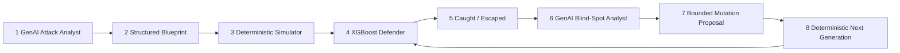

# AEGIS

## Stress-test fraud models against attacks they haven't learned yet.

**Adversarial Evaluation & Generative Immune System for payments.**
Mastercard Innovation Challenge 2026.

**[Live demo](https://mastercard-aegis.vercel.app)** ·
[API](https://mastercard-aegis.onrender.com/api/health) ·
[Repository](https://github.com/tensorforgee/mastercard-aegis) ·
[60-second walkthrough](docs/JUDGE_DEMO_60S.md)

GenAI reasons about emerging attacks and detector blind spots; deterministic
simulators generate every transaction row; a frozen XGBoost defender scores
them; fraud that escapes becomes adversarial evidence — and **LOAFO** then
tests whether hardening actually transfers to an attack family the model has
never seen.

### Headline evidence

Every figure below is read from a persisted artifact **tracked in this
repository**, so it is checkable from a clean clone with no dataset download
and no pipeline run.

| | | Source |
| --- | --- | --- |
| Attack vectors identified | **14** (3 deeply simulated, 11 research-identified only) | [`attack_taxonomy.json`](submission/artifacts/data/reports/attack_taxonomy.json) |
| Synthetic transactions generated | **55,000** across 3,000 scenarios, seed-reproducible | [`generation_scale_benchmark.json`](submission/artifacts/data/reports/generation_scale_benchmark.json) |
| Families with live GenAI evidence | **3 / 3** (Attack Analyst + Blind-Spot Analyst + guided generation) | [`genai_family_summary.json`](submission/artifacts/data/reports/genai_family_summary.json) |
| Defender v3 PR-AUC | **0.904** on the untouched PaySim test split | [`final_benchmark_summary.json`](submission/artifacts/data/reports/final_benchmark_summary.json) |
| Defender v3 recall @ 0.1% FPR | **85.2%** | same |
| Defender v3 false positive rate | **0.0216%** (alert rate 0.35%) | same |
| Generalization to an unseen family | **58.3% mean LOAFO recall — PARTIAL GENERALIZATION** | [`loafo_summary.json`](submission/artifacts/models/loafo_summary.json) |

> **58.3% is not a fraud-detection rate.** It is the recall of three separate
> fold models, each trained with one attack family contributing *zero* rows,
> each scored on one fresh scenario of that held-out family (3–12 fraud events
> each — directional, not statistically powered). Two of three families
> transferred; mule-network structuring did not.

### The closed loop



GenAI reasons at exactly **two** points — stages 1 and 6 — and never writes a
transaction row. Stage 7 is the Blind-Spot Analyst's proposal after a
deterministic bounds check: out-of-range proposals are *rejected, never
clamped*, and the refusals are persisted. The simulator, not the model,
generates the next seeded scenario, which the same frozen defender then
scores (8 → 4).

**LOAFO sits outside this loop.** It is a generalization *test*, not a
generation stage: hold one attack family out of hardening entirely, then
score a fresh scenario of that family. It creates no attacks and proposes no
mutations.

## Why this is different

* **Breadth is researched; depth is measured, and we never conflate them.**
  14 attack vectors catalogued across 8 categories with cited sources —
  exactly 3 have a generator, a blueprint and a real detector result.
* **Attack generation is deterministic and reproducible.** Every corpus
  regenerates from its seed; the scale benchmark persists a SHA-256
  fingerprint proving byte-identical repeat runs, 0% constraint violations,
  and zero scenario-id collisions with prior artifacts.
* **GenAI is live and auditable.** Every reasoning artifact carries provider,
  model, prompt version, latency and a real request id. With no API key the
  layer fails loudly — there is no fallback that invents reasoning text.
* **The mutation contract is enforced, not described.** GenAI supplies a
  direction and magnitude; deterministic code recomputes the value and
  refuses anything outside the blueprint's declared bounds. Refusals are
  persisted and shown in the UI.
* **The defender is frozen during confrontation.** Model file hashes are
  verified unchanged before and after scoring, so a "result" can never be a
  quiet retrain.
* **LOAFO is, as far as we know, novel in this setting** — a leave-one-attack-
  family-out protocol that asks whether hardening *transfers* or merely
  *memorizes*, with each fold's held-out family contributing verifiably zero
  training rows (asserted in tests, not just prose).
* **We publish the results that went against us.** Mule-network structuring
  caught 0 of 12 on its held-out fold. That number is on the landing page, in
  the summary JSON, and in this README.

## The problem

Fraud detectors trained once and left alone go stale: the pattern a model
was tuned against is not the pattern that shows up in production six months
later, because the people committing fraud adapt. Most fraud-detection
demos show a static model scoring a static test set and stop there -- which
never tests the thing that actually matters: **does the detector improve
when it sees new attacks, and does that improvement generalize, or is it
just memorizing what it was shown?**

## How AEGIS works

A closed-loop red-team / blue-team system: a Red Team invents and mutates
synthetic fraud, a Blue Team detects it, and escapes feed the next round.
Where a persisted experiment promoted those escapes as hard positives, they
informed a later hardening round; LOAFO evidence is evaluation-only and never
feeds training. Full contract: [`docs/GENAI_LAYER.md`](docs/GENAI_LAYER.md).

```
IDENTIFY -> GENERATE -> DEFEND -> EVALUATE -> EVOLVE -> RETRAIN
```

| Stage | Module | Consumes | Produces |
| --- | --- | --- | --- |
| IDENTIFY | `identify/` | `IdentificationContext` | `AttackBlueprint` |
| GENERATE | `generate/` | `AttackBlueprint` + `GenerationConfig` | `TransactionBatch` |
| FEATURES | `features/` | `Transaction[]` | feature matrix |
| DEFEND | `defend/` | feature matrix | `DetectorOutput` |
| EVALUATE | `evaluate/` | `DetectorOutput` + ground truth | `EvaluationResult` |
| EVOLVE | `loop/` | `EvasionFeedback` | mutated `AttackBlueprint` |
| RETRAIN | `defend/` | promoted hard positives | new `model_version` |

Every arrow is a **contract** (a frozen pydantic type in
`aegis.shared.contracts`), not a function call into another team's code --
see [`docs/CONTRACTS.md`](docs/CONTRACTS.md) and
[`docs/ARCHITECTURE.md`](docs/ARCHITECTURE.md).

This repository has run that loop for real, on the full PaySim
synthetic/reference corpus, through three defender generations and a formal
generalization benchmark -- not a simulation of what the loop would produce.

## Three attack families, deliberately fixed

| Family | What it is |
| --- | --- |
| `synthetic_identity_bustout` | A fabricated or blended identity builds ordinary payment history, then drains a sudden burst of high-value transfers. |
| `mule_network_structuring` | A coordinator account fans funds out across several mule accounts, layers them, and fans back in to a cash-out -- structured to keep any single transaction unremarkable. |
| `adaptive_detector_evasion` | An attack probes a frozen detector, reads which signals scored it, and mutates its own parameters to stay under threshold. |

Exactly these three, on purpose -- see [Non-goals](#non-goals).

## Architecture

```
src/aegis/
  shared/        contracts, enums, types              shared, frozen
  identify/      blueprint proposal                    Red Team
  generate/      generator interface + 3 generators     Red Team
  features/      feature extractor (21 decision-time-safe columns)
  defend/        detector, action policy, hardening, metrics
  evaluate/      evaluator interface + confrontation reports
  loop/          attacker evolution (adaptive mutation)
  genai/         GenAI reasoning: attack ideation + blind-spot analysis
  api/           read-only artifact API (FastAPI)
web/             judge-facing UI (React + Vite), real data + labeled mock demo
scripts/         reproducible entry points (train, confront, harden, benchmark)
data/            datasets and generated corpora (git-ignored, never committed)
models/          trained detector artifacts (git-ignored, never committed)
tests/           unit, integration, and contract tests
docs/            architecture, contracts, rules, this submission's own docs
```

`api/` and `web/` are **read-only consumers** of what the pipeline already
produced -- they compute nothing, retrain nothing, and never re-run a
generator or detector. See "Real API + UI" below.

## PaySim setup

The canonical payment world is [PaySim](https://www.kaggle.com/datasets/ealaxi/paysim1),
a public synthetic mobile-money simulator (chosen and locked -- see
[`docs/DATA_STRATEGY.md`](docs/DATA_STRATEGY.md)). It is not bundled (multi-GB
CSV); download it yourself and point the preparation script at it:

```bash
python scripts/prepare_paysim.py data/raw/paysim/<your-file>.csv --seed 20260101
```

This produces one deterministic, versioned `train.jsonl` /
`validation.jsonl` / `test.jsonl` split under `data/processed/paysim/<run-id>/`
-- entity- and time-based, never touched by a generator or a detector after
assignment (see [`docs/EVALUATION_RULES.md`](docs/EVALUATION_RULES.md) SS1).
Every training and confrontation script below reads from this one prepared
run, so every model in the progression is comparable on the identical
untouched test split.

## Blue defender progression: v1 -> v2 -> v3

| Version | What it is | Trained on |
| --- | --- | --- |
| **Baseline v1** (`xgboost-baseline-20260101`) | The first real detector: XGBoost over 19 decision-time-safe features. | PaySim train only. |
| **Defender v2** (`xgboost-hardened-r1-20260201`) | Promotes Round-0 and Adaptive-Round-1 bust-out false negatives into training-only hard positives, retrains. | PaySim train + bust-out hard positives. |
| **Defender v3** (`xgboost-hardened-crossfamily-20260301`) | **Cross-family hardening**: promotes prior real hard positives from all three families, retrains with two added features. | PaySim train + hard positives from all 3 families. |

**Cross-family hardening.** Before adding anything, the real mule-network
confrontation data was inspected against the existing 19 features: they
counted prior transaction *volume* per account but never distinct
*counterparties*, so a coordinator paying one destination six times and one
paying six distinct destinations once each looked identical -- exactly the
difference between ordinary payments and mule fan-out. Two columns were
added to close that specific gap: `source_distinct_destinations_before`,
`destination_distinct_sources_before` (21 columns total, same causal,
decision-time-safe rules as the other 19; see
[`docs/BASELINE_DETECTOR.md`](docs/BASELINE_DETECTOR.md)).

On the untouched PaySim test split:

| Metric | Baseline v1 | Defender v2 | Defender v3 |
| --- | --- | --- | --- |
| Precision | 92.9% | 93.1% | **93.8%** |
| Recall | 79.5% | 77.1% | 77.9% |
| F1 | 85.7% | 84.3% | 85.1% |
| FPR | 0.0254% | 0.0242% | **0.0216%** |
| Mean latency | 6.86ms | 12.28ms | 6.66ms |

**Hardening changed the operating trade-off; it did not uniformly improve
every native-test metric.** On this split baseline v1 still leads PR-AUC
(0.909 vs 0.904), recall and F1; Defender v3 leads precision, false positive
rate and recall at a 0.1% FPR budget (85.24% vs 85.06%). Cross-family
hardening improved precision, F1 and FPR versus Defender v2 and closed most
of v2's regression against v1 on the *native* task -- while adding training
signal from two families v2 had never seen. We state this plainly because it
is the first thing a fraud-modelling reviewer will check. Full numbers, per-family
breakdowns, and confusion matrices:
[`submission/artifacts/data/reports/final_benchmark_summary.json`](submission/artifacts/data/reports/final_benchmark_summary.json)
-- tracked in this repo, so the link resolves in a clean clone.
(`scripts/build_final_benchmark_summary.py` regenerates it into the
git-ignored working-tree `data/reports/`; the copy under
[`submission/artifacts/`](submission/artifacts) is the tracked evidence
bundle.)

## LOAFO: does hardening generalize, or just memorize?

Cross-family hardening trains *with* all three families. To test whether
that training actually transfers to a family a detector has never seen at
all, AEGIS runs **Leave-One-Attack-Family-Out (LOAFO)**: three folds, each
trained on two families' hard positives with the third contributing **zero**
training rows, then scored on one fresh, real, previously-unseen scenario of
that held-out family (`scripts/run_loafo_benchmark.py`,
[`docs/EVALUATION_RULES.md`](docs/EVALUATION_RULES.md) SS6). Defender v3 is
scored on the identical fresh scenario as a memorization reference.

| Held out | Trained on | LOAFO recall | Defender v3 recall (same scenario) | Verdict |
| --- | --- | --- | --- | --- |
| `adaptive_detector_evasion` | Synthetic + Mule | 75% | 100% | strong |
| `mule_network_structuring` | Synthetic + Adaptive | **0%** | 42% | weak |
| `synthetic_identity_bustout` | Mule + Adaptive | 100% | 100% | strong |

Mean LOAFO recall: **58.3%**. Two of three families transfer well from the
other two; mule-network structuring does not transfer at all in this
benchmark. Generalization is **partial**, not universal -- see
[`docs/CLAIMS_AUDIT.md`](docs/CLAIMS_AUDIT.md) for exactly what is and is
not supported by this result.

## GenAI reasoning layer

A language model is used for **reasoning only**, at two points that bracket
the deterministic core:

```
research/taxonomy -> [GenAI ATTACK ANALYST] -> structured blueprint parameters
                  -> deterministic simulator -> XGBoost defender
                  -> evasion + fidelity feedback
                  -> [GenAI BLIND-SPOT ANALYST] -> bounded mutation proposal
                  -> next simulation
```

* **Attack Analyst** turns researched fraud-taxonomy material into a
  structured attack hypothesis with recommended simulator parameters.
* **Blind-Spot Analyst** reads a real detector's real failures (missed
  transactions, the risk scores actually assigned, the signals that drove
  them) and proposes bounded next-generation mutations.

The numeric simulator stays deterministic on purpose: every corpus must be
reproducible from its seed, fidelity is a structural gate rather than a
judgement call, and mutation proposals are bounded to parameters the
blueprint declares mutable (rejected, never clamped, if out of bounds). If no
API key is configured the layer **fails loudly** — there is no fallback that
produces default reasoning text, and an offline replay is always stamped
`live: false` in its artifact.

```bash
python -m pip install -e ".[genai]"
export ANTHROPIC_API_KEY=...    # never committed
python scripts/run_genai_analysis.py attack-analyst --scenario synthetic-identity-bustout
```

Full contract, artifact format, configuration, and the exact claims this
supports: [`docs/GENAI_LAYER.md`](docs/GENAI_LAYER.md).

## Real API + UI

`src/aegis/api/` (FastAPI) reads persisted artifacts under `models/` and
`data/` and serves them read-only:

```
GET /api/overview            GET /api/evaluation
GET /api/attacks              GET /api/attacks/:id
GET /api/detections/recent    GET /api/evolution
GET /api/hardest-evasions     GET /api/benchmark
```

`web/` (React + Vite) is an eight-screen UI, four of them primary:
**Overview** (`/`), **Attack Lab** (`/attack-lab`), **Evolution**
(`/co-evolution`) and **Results** (`/final-benchmark`). Every screen except
the interactive Co-Evolution demo reads real data through
`web/src/api/client.ts`, labeled "Real pipeline data"; the client-side mock
demo (unrelated code, `web/src/mock/`) is kept alongside it and always
labeled "Simulated demo (not real data)" -- the two are never blended
without a label.

**Overview** is the judge-facing entry point. Its hero, closed-loop diagram
and "Where AEGIS fits" panel are entirely static, so the whole system is
explained before any API call resolves; the three evidence cards below them
read `/api/landscape`, `/api/genai` and `/api/benchmark` independently, each
with its own loading and error state. It deliberately shows no aggregate
recall summed across scenarios -- those are separate scenarios scored by
different models, and one number over them would be confusable with PaySim
test recall and with LOAFO mean recall.

**Results** is the full benchmark summary: v1 vs v2 vs v3, recall by family,
LOAFO results, hardest surviving attacks. See
[`docs/UI_DESIGN_SYSTEM.md`](docs/UI_DESIGN_SYSTEM.md).

## How to run locally

**Clean clone, no PaySim download:** this repo tracks a small, real, minimal
demo-artifact bundle at [`submission/artifacts/`](submission/artifacts) (JSON
evaluation/confrontation/benchmark evidence only -- no trained model weights,
no PaySim data). Point the API at it and skip straight to step 4:

```bash
python -m pip install -e ".[api]"
AEGIS_ARTIFACTS_ROOT=submission/artifacts uvicorn aegis.api.app:app --reload --port 8000
cd web && npm install && npm run dev
```

See [`docs/DEPLOYMENT.md`](docs/DEPLOYMENT.md) "Clean-clone quick start" for
what is (and is not) in that bundle. To instead reproduce the full pipeline
from the PaySim synthetic/reference corpus:

```bash
# 1. Python environment
python -m pip install -e ".[dev,api]"

# 2. PaySim data (see "PaySim setup" above) -- one-time, produces
#    data/processed/paysim/<run-id>/{train,validation,test}.jsonl
python scripts/prepare_paysim.py data/raw/paysim/<your-file>.csv --seed 20260101

# 3. Reproduce the defender progression (each writes to its own models/<version>/,
#    never overwriting a prior one) -- optional if you only want the UI, since
#    everything in this repo's own data/reports/final_benchmark_summary.json
#    was already produced by this exact sequence
python scripts/train_baseline_detector.py data/processed/paysim/<run-id> --seed 20260101 --low-memory
python scripts/harden_defender.py data/processed/paysim/<run-id> --low-memory
python scripts/harden_defender_crossfamily.py data/processed/paysim/<run-id> --low-memory
python scripts/run_loafo_benchmark.py data/processed/paysim/<run-id>
python scripts/build_final_benchmark_summary.py

# 4. API (terminal 1)
uvicorn aegis.api.app:app --reload --port 8000

# 5. UI (terminal 2)
cd web && npm install && npm run dev
```

Opens at `http://localhost:5173`; the dev server proxies `/api/*` to
`http://localhost:8000` with no CORS setup needed. See
[`web/README.md`](web/README.md).

```bash
python -m pytest        # or: make test / make check (lint + typecheck + test)
```

## Deployment notes

The live demo does **not** require the multi-GB PaySim CSV or a retraining
step -- it needs only the small JSON evidence bundle already tracked at
[`submission/artifacts/`](submission/artifacts) (model `metadata.json` /
`evaluation_*.json`, LOAFO fold reports, confrontation reports and
`data/reports/final_benchmark_summary.json`), served read-only by the API
behind a static frontend. Full plan, environment variables, and a
no-backend fallback path: [`docs/DEPLOYMENT.md`](docs/DEPLOYMENT.md).

## Limitations

* Not a claim of universal fraud detection. See
  [`docs/CLAIMS_AUDIT.md`](docs/CLAIMS_AUDIT.md) for the full audit of what
  is and is not supported.
* LOAFO's fresh evaluations are one real scenario per family (3-12 fraud
  events) -- directional evidence, not a statistically powered estimate.
  Mule-network structuring generalized weakly (0% LOAFO recall) even where
  the other two families generalized strongly.
* No production latency SLA is claimed; reported latency is mean/p50/p95
  scoring time over a fixed sample on one machine, not a load-tested figure.
* Multi-round self-play (retrain -> fresh Red generation -> retrain,
  repeated) beyond the sequence already run is not implemented.
* Cross-workstream boundaries in [`AGENTS.md`](AGENTS.md) remain binding:
  `identify/`, `generate/`, `loop/` are Red-owned; `defend/`, `features/`
  are Blue-owned; `shared/` is jointly owned and frozen; `api/`/`web/` are
  read-only consumers of both.

## Documentation

| Doc | Read it when |
| --- | --- |
| [`AGENTS.md`](AGENTS.md) | **Before writing any code.** Ownership and rules. |
| [`docs/ARCHITECTURE.md`](docs/ARCHITECTURE.md) | Understanding module boundaries and the API architecture. |
| [`docs/CONTRACTS.md`](docs/CONTRACTS.md) | Using or changing a shared type. |
| [`docs/EVALUATION_RULES.md`](docs/EVALUATION_RULES.md) | Producing any number. Binding. |
| [`docs/DATA_STRATEGY.md`](docs/DATA_STRATEGY.md) | Touching a dataset. Locked. |
| [`docs/BASELINE_DETECTOR.md`](docs/BASELINE_DETECTOR.md) | The detector, hardening rounds 1-3, and the feature set. |
| [`docs/SYNTHETIC_IDENTITY_BUSTOUT.md`](docs/SYNTHETIC_IDENTITY_BUSTOUT.md), [`docs/MULE_NETWORK_STRUCTURING.md`](docs/MULE_NETWORK_STRUCTURING.md), [`docs/ADAPTIVE_DETECTOR_EVASION.md`](docs/ADAPTIVE_DETECTOR_EVASION.md) | The three Red Team generators, one doc each. |
| [`docs/ADAPTIVE_ATTACK_EVOLUTION.md`](docs/ADAPTIVE_ATTACK_EVOLUTION.md), [`docs/RED_BLUE_CONFRONTATION.md`](docs/RED_BLUE_CONFRONTATION.md) | Adaptive evolution and the confrontation harness. |
| [`docs/UI_DESIGN_SYSTEM.md`](docs/UI_DESIGN_SYSTEM.md) | The UI's screens, real-vs-mock labeling, and visual language. |
| [`docs/GENAI_LAYER.md`](docs/GENAI_LAYER.md) | Where GenAI reasons, and why the simulator stays deterministic. |
| [`docs/JUDGE_DEMO_60S.md`](docs/JUDGE_DEMO_60S.md) | **The 60-second judge walkthrough.** Start here to present. |
| [`docs/DEMO_FLOW.md`](docs/DEMO_FLOW.md) | The longer 4-6 minute demo script. |
| [`docs/COMMERCIAL.md`](docs/COMMERCIAL.md) | Who would use AEGIS, what it needs, and what it explicitly is not. |
| [`docs/CLAIMS_AUDIT.md`](docs/CLAIMS_AUDIT.md) | What this submission does and does not claim. |
| [`docs/DEPLOYMENT.md`](docs/DEPLOYMENT.md) | Deploying the demo. |
| [`docs/SUBMISSION_CHECKLIST.md`](docs/SUBMISSION_CHECKLIST.md) | Final submission steps. |

## Development

| Command | Does |
| --- | --- |
| `make install-dev` | Editable install with dev tooling. |
| `make test` | Run the test suite. |
| `make lint` | `ruff check .` |
| `make format` | `ruff format .` + autofix. |
| `make typecheck` | `mypy` (strict on `src/`). |
| `make check` | Lint + typecheck + test. |
| `make verify` | Smoke-check the install and contract surface. |

Runtime dependencies are pydantic, numpy, pandas, and xgboost; `fastapi` +
`uvicorn` behind the optional `api` extra. Nothing else, on purpose.

## Non-goals

Exactly three attack families -- do not add a fourth. Multi-round self-play
beyond the sequence already run, SDV/CTGAN, LangGraph, GRPO, cloud
infrastructure, authentication, databases, and Docker remain out of scope.
Cross-workstream boundaries are governed by [`AGENTS.md`](AGENTS.md).
